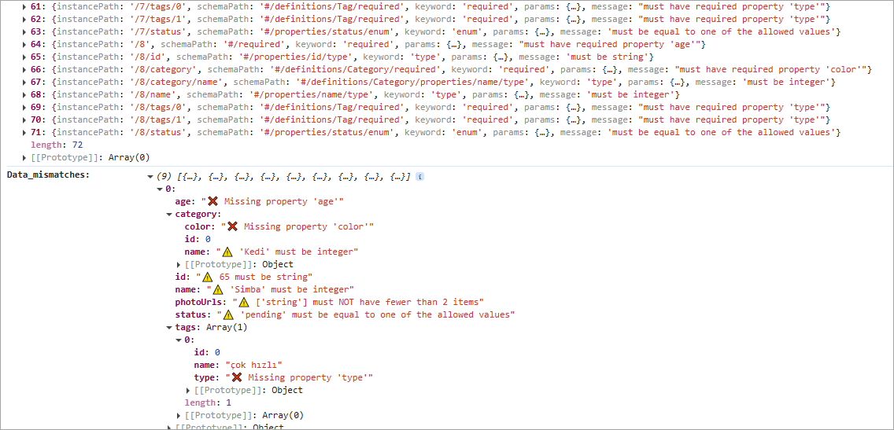

# core-ajv-schema-validator

Plugin for API testing to validate API responses against plain JSON schemas, Swagger documents, or OpenAPI documents using the Ajv JSON Schema validator. It can be used directly in any project, but also serves as the core engine for schema validation in the cypress-ajv-schema-validator and playwright-ajv-schema-validator.




## Main Features

- Function **`validateSchema()`** to report JSON Schema validation errors in the response obtained from any network request.
  
- The schema is provided as a JSON object and supports: **plain JSON schema**, **OpenAPI 3 schema document** and **Swagger 2.0 schema document**.

- Provides the full list of errors as delivered by the Ajv, and a user-friendly view of the mismatches between the validated data and the JSON schema, highlighting where each validation error occurred and the exact reason for the mismatch

- Relies on the **Ajv JSON Schema Validator** as its powerful core engine for schema validation.


## About JSON Schemas and Ajv JSON Schema Validator

### JSON Schema

JSON Schema is a hierarchical, declarative language that describes and validates JSON data.

### OpenAPI 3 and Swagger 2.0 Schema Documents

The OpenAPI Specification (formerly Swagger Specification) are schema documents to describe your entire API (in JSON format or XML format). So a schema document will contain multiple schemas, one for each supported combination of **_Endpoint - Method - Expected Response Status_** (also called _path_) by that API.

### Ajv JSON Schema Validator

AJV, or Another JSON Schema Validator, is a JavaScript library that validates data objects against a JSON Schema structure.

It was chosen as the core engine of the `core-ajv-schema-validator` plugin because of its versatility, speed, capabilities, continuous maintenance, and excellent documentation. For more information on Ajv, visit the [Ajv official website](https://ajv.js.org/).

Ajv supports validation of the following schema formats: **JSON Schema**, **OpenAPI 3.0.1** specification, and **Swagger 2.0** specification. However, Ajv needs to be provided with the specific schema to be validated for an endpoint, method, and expected response; it cannot process a full OpenAPI 3.0.1 or Swagger 2.0 schema document by itself.

The `core-ajv-schema-validator` plugin simplifies this by obtaining the correct schema definition for the endpoint you want to test. You just need to provide the full schema document (OpenAPI or Swagger) and the path to the schema definition of the service you want to validate for your API (_Endpoint - Method - Expected Response Status_).

> **Note:** The Ajv instance used in this plugin (`core-ajv-schema-validator`) is configured with the options `{ allErrors: true, strict: false }` to display all validation errors and disable strict mode.

&nbsp; 


## Installation

```sh
npm install -D core-ajv-schema-validator
```


## Compatibility

- Ajv 8.17.1 or higher
- ajv-formats 3.0.1 or higher


## API Reference

### `validateSchema(data, schema, [path])`

Function that validates the given data against the provided schema.

#### Parameters

- **`data`** (required)
  - **Type:** `any`
  - **Description:** The data to be validated.

- **`schema`** (required)
  - **Type:** `object`
  - **Description:** The schema to validate against. Supported formats are:
    - Plain JSON schema
    - Swagger document
    - OpenAPI document
    See the [Ajv JSON Schema documentation](https://ajv.js.org/json-schema.html) for more information.

- **`path`** (optional)
  - **Type:** `object`
  - **Description:** The path object to the schema definition in a Swagger or OpenAPI document. Not required if using a plain JSON schema.
    - **`path.endpoint`** (required for Swagger/OpenAPI documents)
      - **Type:** `string`
      - **Description:** The endpoint path.
    - **`path.method`** (optional)
      - **Type:** `string`
      - **Description:** The HTTP method. Defaults to `'GET'` if not provided.
    - **`path.status`** (optional)
      - **Type:** `integer`
      - **Description:** The response status code. Defaults to `200` if not provided.

- **`issuesStyles`**  (optional)
  - **Type:** `object`  
  - **Description:**  An object with the icons used to flag the schema issues. If not provided, it will use the default icons defined in the plugin. Includes the following properties:
    - **`iconPropertyError`**: The icon used to flag type errors in the data.
    - **`iconPropertyMissing`**: The icon used to flag missing properties in the data.


#### Returns

An object containing the following properties:

- **`errors`**  
  - **Type:** `array`  
  - **Description:** An array of validation errors as provided by Ajv, or `null` if the data is valid against the schema.

- **`dataMismatches`**  
  - **Type:** `object`  
  - **Description:** The original response data with all schema mismatches directly flagged.


#### Throws
- **Error:** If any of the required parameters are missing or if the schema or schema definition cannot be found.

Example providing a Plain JSON schema:

```js
  //...
  const data = response.body
  const { errors, dataMismatches } = validateSchema(data, schema);
  expect(errors).to.have.length(0); // Assertion to ensure no validation errors
  console.log(dataMismatches)
  //...
```

Example providing an OpenAPI 3.0.1 or Swagger 2.0 schema documents, a path to the schema definition, and issuesStyles:

```js
  const issuesStyles = {
      iconPropertyError: '🔸',
      iconPropertyMissing: '🔴'
  }
  const data = response.body

  const { errors, dataMismatches } = validateSchema(data, schema, { endpoint: '/users/{id}', method: 'GET', status: 200 }, issuesStyles);

  expect(errors).to.have.length(0); // Assertion to ensure no validation errors
  console.log(dataMismatches)
```

## Usage Examples

### Example: Using `validateSchema` Function in Cypress Test Framework

#### OpenAPI 3.0.1

```js
import validateSchema from 'core-ajv-schema-validator';

describe('API Schema Validation Function', () => {
  it('should validate the user data using validateSchema function', () => {
    const schema = {
      "openapi": "3.0.1",
      "paths": {
        "/users/{id}": {
          "get": {
            "responses": {
              "200": {
                "content": {
                  "application/json": {
                    "schema": { "$ref": "#/components/schemas/User" }
                  }
                }
              }
            }
          }
        }
      },
      "components": {
        "schemas": {
          "User": {
            "type": "object",
            "properties": {
              "name": { "type": "string" },
              "age": { "type": "number" }
            },
            "required": ["name", "age"]
          }
        }
      }
    };

    const path = { endpoint: '/users/{id}', method: 'GET', status: 200 };

    cy.request('GET', 'https://awesome.api.com/users/1').then(response => {
      const { errors, dataMismatches } = validateSchema(response.body, schema, path);
      
      expect(errors).to.have.length(0); // Assertion to ensure no validation errors
      console.log(dataMismatches)
    });
  });
});
```
 

## License

This project is licensed under the MIT License. See the [LICENSE](LICENSE) file for more details.


## Changelog

### [1.0.0]
- Initial release: It is the core for `cypress-ajv-schema-validator@2.0.0`.


## Support

If you'd like to support my work, consider buying me a coffee or contributing to a training session, so I can keep learning and sharing cool stuff with all of you. Thank you for your support!

<a href="https://www.buymeacoffee.com/sclavijosuero" target="_blank"></a>
